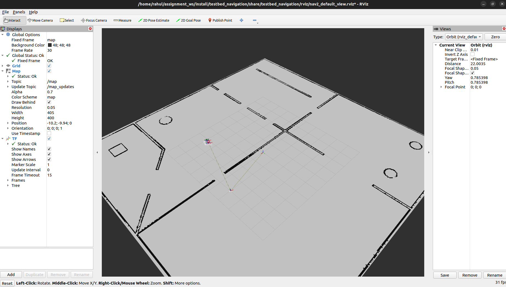
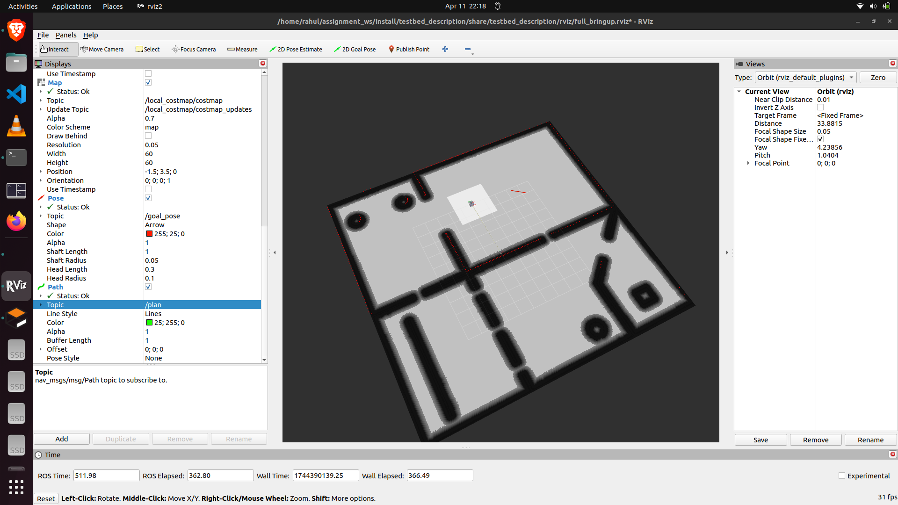

Here's an updated version of your `README.md` with **both screenshots (`assign_sim.png` and `assign_sim2.png`)** included under the Results section, along with a few small polish edits to improve flow:

---

# ROS2 Navigation Assignment

## Overview

This project is part of an assignment to implement a modular navigation system for the **Testbed-T1.0.0** robot using ROS2’s Nav2 stack. The objective is to manually configure and launch the navigation components—**map loading**, **localization**, and **path planning**—rather than relying on prebuilt bring-up packages.

## Repository Structure

```
ros_nav2_assignment/
├── testbed_description/
│   ├── launch/            # Launch the full base simulation
│   ├── meshes/
│   ├── rviz/              # RVIZ configuration files
│   └── urdf/              # URDF files for Testbed-T1.0.0
├── testbed_gazebo/
│   ├── worlds/            # Simulation world files
│   ├── launch/            # Launch files for Gazebo
│   └── models/            # Misc. Gazebo model files
├── testbed_bringup/
│   ├── launch/            # Launch file for bringing up the robot
│   └── maps/              # Predefined map of the test environment
└── testbed_navigation/
    ├── launch/            # Launch files for navigation
    ├── config/            # Configuration files for navigation
    └── rviz/              # RVIZ configuration files
```

## Setup Instructions

### 1. Environment Setup

- **ROS2 Humble** (Ubuntu 22.04)
- **Gazebo** version 11.10.2
- **RViz** for visualization

### 2. Build the Workspace

```bash
mkdir -p ~/assignment_ws/src
cd ~/assignment_ws/src
git clone https://github.com/rahulrajak6942/assignment_ws.git
cd ~/assignment_ws
colcon build
source install/setup.bash
```

### 3. Running the Navigation Stack

1. **Launch simulation environment**:
   ```bash
   ros2 launch testbed_bringup testbed_full_bringup.launch.py
   ```

2. **Launch map server**:
   ```bash
   ros2 launch testbed_navigation map_loader.launch.py
   ```

3. **Launch localization**:
   ```bash
   ros2 launch testbed_navigation localization.launch.py
   ```

4. **Launch navigation**:
   ```bash
   ros2 launch testbed_navigation navigation.launch.py
   ```

### 4. RViz Configuration

- Set the "Fixed Frame" to `map`
- Add visualizations: Map, Global Costmap, Local Costmap, RobotModel, and Path
- Use **"2D Pose Estimate"** to initialize the robot position
- Use **"2D Goal Pose"** to send navigation goals

---

## Results

The robot was able to **successfully localize and navigate** to target positions in the simulation world using manually configured navigation components.

### Screenshots

| RViz Navigation | Goal Reached |
|-----------------|---------------|
|  |  |

---

## Challenges Faced

- Properly tuning the **costmap parameters** for accurate inflation and obstacle detection
- Ensuring all **TF transforms** (map → odom → base_link → sensor frames) were correctly published
- Debugging initial pose estimation when the robot failed to localize without manual intervention

---

## Conclusion

This project demonstrates the ability to:
- Manually configure and orchestrate the Nav2 stack components
- Structure a navigation package in a modular way
- Launch each navigation step independently for better control and debugging

This modular setup will help scale the navigation system and adapt it to various robot platforms in future tasks.

---

Let me know if you'd like to add your GitHub link, a YouTube video link, or make it even more formal!
